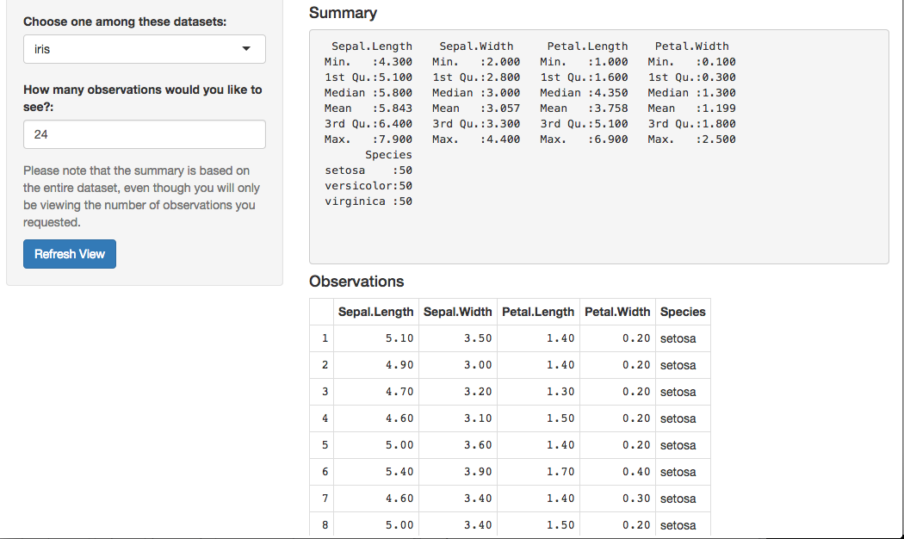

## What does the Shiny app do?

The Shiny app I developed is one that allows you to take a quick peek
at the library of datasets in R and also take a quick look at the first n number of observations you'd like to see.

You can load the datasets with the "library(datasets)" command in R. To get a quick idea of the databases inside, run "library(help=datsets)".

As an example, I have already uploaded the iris dataset and now look at the first 6 rows:
```{r,echo=TRUE}
head(iris,6)
```

--- 


## What it looks like

This Shiny app allows you to take a quick glance at the first, for example, 10 observations of some of these datasets. The default is the first 10 observations of the dataset "rock".

<div style='text-align: center;'>
           

</div>

--- 

## Another example

Here, for example, you can look at the first 24 observations of the iris dataset:
<div style='text-align: center;'>
           

</div>

--- 

## Hope you liked it!


Now you know what the data look like (size, values, ranges, etc.), you can go forth and plan your analyses on them carefully. 

Good luck!
